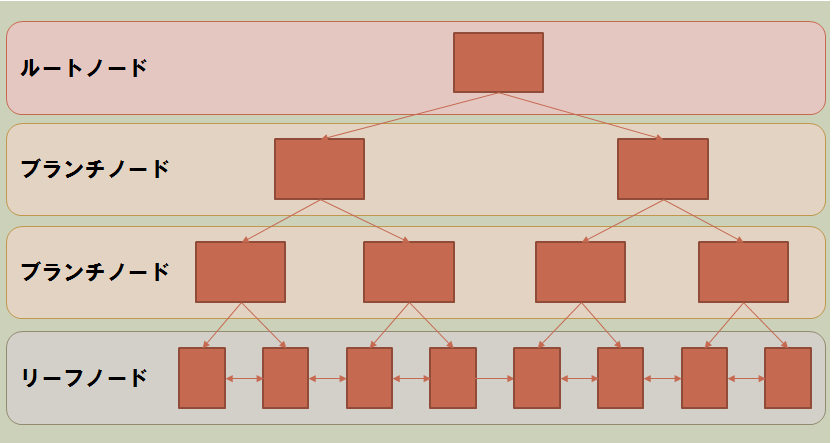
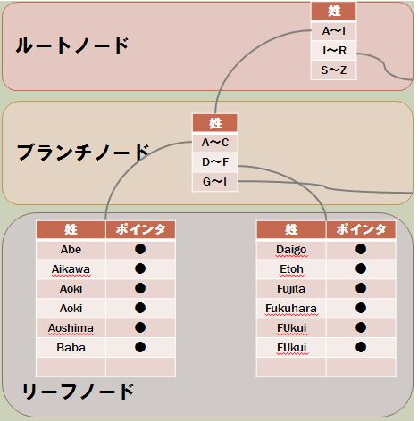
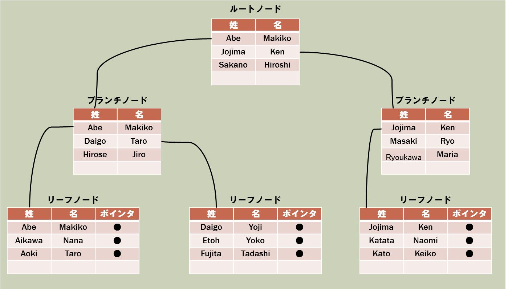

# ISUCON_memo

# alp

JSON形式にアクセスログを出力する

```
log_format json escape=json '{"time":"$time_iso8601",'
    '"host":"$remote_addr",'
    '"port":$remote_port,'
    '"method":"$request_method",'
    '"uri":"$request_uri",'
    '"status":"$status",'
    '"body_bytes":$body_bytes_sent,'
    '"referer":"$http_referer",'
    '"ua":"$http_user_agent",'
    '"request_time":"$request_time",'
    '"response_time":"$upstream_response_time"}';
```

- request_time: リクエストに要した時間（秒）
- upstream_response_time: リバースプロキシとして動作する場合にプロキシ先からのレスポンスを得るまでの時間（秒）

alpというアクセスログを解析するツールを用いる

https://github.com/tkuchiki/alp

```
alp -h
alp is the access log profiler for LTSV, JSON, Pcap, and others.

Usage:
  alp [flags]
  alp [command]

Available Commands:
  completion  Generate the autocompletion script for the specified shell
  count       Count by log entries
  diff        Show the difference between the two profile results
  help        Help about any command
  json        Profile the logs for JSON
  ltsv        Profile the logs for LTSV
  pcap        Profile the HTTP requests for captured packets
  regexp      Profile the logs that match a regular expression

Flags:
  -h, --help      help for alp
  -v, --version   version for alp

Use "alp [command] --help" for more information about a command.
```

alpを使ったログ解析方法

```
alp json --file logs/nginx/access.log

+-------+-----+-----+-----+-----+-----+--------+------------------+-------+-------+-------+-------+-------+-------+-------+--------+-------------+-------------+-------------+-------------+
| COUNT | 1XX | 2XX | 3XX | 4XX | 5XX | METHOD |       URI        |  MIN  |  MAX  |  SUM  |  AVG  |  P90  |  P95  |  P99  | STDDEV |  MIN(BODY)  |  MAX(BODY)  |  SUM(BODY)  |  AVG(BODY)  |
+-------+-----+-----+-----+-----+-----+--------+------------------+-------+-------+-------+-------+-------+-------+-------+--------+-------------+-------------+-------------+-------------+
| 1     | 0   | 1   | 0   | 0   | 0   | GET    | /                | 5.892 | 5.892 | 5.892 | 5.892 | 5.892 | 5.892 | 5.892 | 0.000  | 35644.000   | 35644.000   | 35644.000   | 35644.000   |
| 1     | 0   | 1   | 0   | 0   | 0   | GET    | /image/10000.png | 0.009 | 0.009 | 0.009 | 0.009 | 0.009 | 0.009 | 0.009 | 0.000  | 1056749.000 | 1056749.000 | 1056749.000 | 1056749.000 |
| 1     | 0   | 1   | 0   | 0   | 0   | GET    | /image/9999.jpg  | 0.014 | 0.014 | 0.014 | 0.014 | 0.014 | 0.014 | 0.014 | 0.000  | 89928.000   | 89928.000   | 89928.000   | 89928.000   |
| 1     | 0   | 1   | 0   | 0   | 0   | GET    | /image/9998.jpg  | 0.013 | 0.013 | 0.013 | 0.013 | 0.013 | 0.013 | 0.013 | 0.000  | 61656.000   | 61656.000   | 61656.000   | 61656.000   |
| 1     | 0   | 1   | 0   | 0   | 0   | GET    | /image/9997.jpg  | 0.020 | 0.020 | 0.020 | 0.020 | 0.020 | 0.020 | 0.020 | 0.000  | 176404.000  | 176404.000  | 176404.000  | 176404.000  |
| 1     | 0   | 1   | 0   | 0   | 0   | GET    | /image/9996.jpg  | 0.038 | 0.038 | 0.038 | 0.038 | 0.038 | 0.038 | 0.038 | 0.000  | 374805.000  | 374805.000  | 374805.000  | 374805.000  |
| 1     | 0   | 1   | 0   | 0   | 0   | GET    | /image/9995.jpg  | 0.041 | 0.041 | 0.041 | 0.041 | 0.041 | 0.041 | 0.041 | 0.000  | 123364.000  | 123364.000  | 123364.000  | 123364.000  |
| 1     | 0   | 1   | 0   | 0   | 0   | GET    | /image/9994.jpg  | 0.033 | 0.033 | 0.033 | 0.033 | 0.033 | 0.033 | 0.033 | 0.000  | 105154.000  | 105154.000  | 105154.000  | 105154.000  |
| 1     | 0   | 1   | 0   | 0   | 0   | GET    | /image/9993.jpg  | 0.037 | 0.037 | 0.037 | 0.037 | 0.037 | 0.037 | 0.037 | 0.000  | 85546.000   | 85546.000   | 85546.000   | 85546.000   |
| 1     | 0   | 1   | 0   | 0   | 0   | GET    | /image/9991.jpg  | 0.018 | 0.018 | 0.018 | 0.018 | 0.018 | 0.018 | 0.018 | 0.000  | 153465.000  | 153465.000  | 153465.000  | 153465.000  |
| 1     | 0   | 1   | 0   | 0   | 0   | GET    | /image/9990.jpg  | 0.023 | 0.023 | 0.023 | 0.023 | 0.023 | 0.023 | 0.023 | 0.000  | 102371.000  | 102371.000  | 102371.000  | 102371.000  |
| 1     | 0   | 1   | 0   | 0   | 0   | GET    | /image/9989.jpg  | 0.018 | 0.018 | 0.018 | 0.018 | 0.018 | 0.018 | 0.018 | 0.000  | 107460.000  | 107460.000  | 107460.000  | 107460.000  |
| 1     | 0   | 1   | 0   | 0   | 0   | GET    | /image/9988.jpg  | 0.021 | 0.021 | 0.021 | 0.021 | 0.021 | 0.021 | 0.021 | 0.000  | 111515.000  | 111515.000  | 111515.000  | 111515.000  |
| 1     | 0   | 1   | 0   | 0   | 0   | GET    | /image/9987.jpg  | 0.024 | 0.024 | 0.024 | 0.024 | 0.024 | 0.024 | 0.024 | 0.000  | 367388.000  | 367388.000  | 367388.000  | 367388.000  |
| 1     | 0   | 1   | 0   | 0   | 0   | GET    | /image/9986.jpg  | 0.024 | 0.024 | 0.024 | 0.024 | 0.024 | 0.024 | 0.024 | 0.000  | 86624.000   | 86624.000   | 86624.000   | 86624.000   |
| 1     | 0   | 1   | 0   | 0   | 0   | GET    | /image/9985.jpg  | 0.022 | 0.022 | 0.022 | 0.022 | 0.022 | 0.022 | 0.022 | 0.000  | 83264.000   | 83264.000   | 83264.000   | 83264.000   |
| 1     | 0   | 1   | 0   | 0   | 0   | GET    | /image/9983.jpg  | 0.023 | 0.023 | 0.023 | 0.023 | 0.023 | 0.023 | 0.023 | 0.000  | 98082.000   | 98082.000   | 98082.000   | 98082.000   |
| 1     | 0   | 1   | 0   | 0   | 0   | GET    | /image/9982.jpg  | 0.023 | 0.023 | 0.023 | 0.023 | 0.023 | 0.023 | 0.023 | 0.000  | 149874.000  | 149874.000  | 149874.000  | 149874.000  |
| 1     | 0   | 1   | 0   | 0   | 0   | GET    | /image/9981.jpg  | 0.022 | 0.022 | 0.022 | 0.022 | 0.022 | 0.022 | 0.022 | 0.000  | 81386.000   | 81386.000   | 81386.000   | 81386.000   |
| 1     | 0   | 1   | 0   | 0   | 0   | GET    | /image/9980.jpg  | 0.016 | 0.016 | 0.016 | 0.016 | 0.016 | 0.016 | 0.016 | 0.000  | 95919.000   | 95919.000   | 95919.000   | 95919.000   |
| 1     | 0   | 1   | 0   | 0   | 0   | GET    | /image/9979.jpg  | 0.015 | 0.015 | 0.015 | 0.015 | 0.015 | 0.015 | 0.015 | 0.000  | 66941.000   | 66941.000   | 66941.000   | 66941.000   |
+-------+-----+-----+-----+-----+-----+--------+------------------+-------+-------+-------+-------+-------+-------+-------+--------+-------------+-------------+-------------+-------------+
```

alpのデフォルトの出力結果はログのURLごとの行数（count）の昇順

--sortオプションで他の要素でソートできる

-rで降順でソートできる

```
--sort=sum -r: URI別のレスポンスタイムの合計が多い順
--sort=avg -r: URL別のレスポンスタイムの平均が大きい順
```

同一のパスとして処理したい場合、以下を指定する

```
--matching-group=PATTERN
```

例えば `/diary/entry/1234`と`/diary/entry/5678`を同一URLとするときは`-m /diary/entry/[0-9]+`とする

カンマ区切りで複数指定可能

試験ごとにアクセスログをローテートするのを忘れずに

ログの出力先を新ファイルにするためにログファイルを開き直すシグナル

```
/usr/sbin/nginx -s reopen
```

# ab

HTTPのベンチマーカー ab

https://httpd.apache.org/docs/2.4/programs/ab.html

Macはデフォルトで入っている

```
ab -c 1 -n 10 http://localhost/

This is ApacheBench, Version 2.3 <$Revision: 1879490 $>
Copyright 1996 Adam Twiss, Zeus Technology Ltd, http://www.zeustech.net/
Licensed to The Apache Software Foundation, http://www.apache.org/

Benchmarking localhost (be patient).....done


Server Software:        nginx/1.24.0
Server Hostname:        localhost
Server Port:            80

Document Path:          /
Document Length:        35644 bytes

Concurrency Level:      1
Time taken for tests:   7.806 seconds
Complete requests:      10
Failed requests:        0
Total transferred:      360070 bytes
HTML transferred:       356440 bytes
Requests per second:    1.28 [#/sec] (mean)
Time per request:       780.582 [ms] (mean)
Time per request:       780.582 [ms] (mean, across all concurrent requests)
Transfer rate:          45.05 [Kbytes/sec] received

Connection Times (ms)
              min  mean[+/-sd] median   max
Connect:        0    0   0.0      0       0
Processing:   772  780  13.0    776     816
Waiting:      771  778  13.0    774     814
Total:        773  780  13.0    776     816

Percentage of the requests served within a certain time (ms)
  50%    776
  66%    777
  75%    781
  80%    781
  90%    816
  95%    816
  98%    816
  99%    816
 100%    816 (longest request)
```

Concurrency Levelは並列度のことで、Time taken for testsは完了までの経過時間

Complete/Failed requestが成功・失敗したリクエスト数、Total transferredはサーバから転送されたバイト数の合計

Requests per secondは一秒間あたりに処理できたリクエスト数

Time per requestは1リクエストを処理するためにかかった経過時間（m秒）の平均値

よく使うオプション

```
-c: クライアント数
-k: HTTP KeepAliveを有効にする
-n: 試行回数
-t: 試行時間
-C: Cookieヘッダを指定
-H: 任意のHTTPヘッダを指定
-p: POSTするbodyのファイルを指定（-Tが必要）
-l: レスポンスのサイズがリクエストごとに異なる場合でも失敗にしない
```

# MySQLのスロークエリ解析

my.cnfにスロークエリに関する記述を追加

```
[mysqld]

slow_query_log=1
slow_query_log_file=/var/log/mysql/mysqlslow.log
long_query_time=0
```

設定追加後は再起動が必要

```
systemctl restart mysql
```

mysqldumpslowコマンドを実行

```
mysqldumpslow logs/mysql/mysqlslow.log

Reading mysql slow query log from logs/mysql/mysqlslow.log
Count: 440  Time=0.03s (11s)  Lock=0.00s (0s)  Rows=3.0 (1320), root[root]@webapp-app-1.webapp_default
  SELECT * FROM `comments` WHERE `post_id` = N ORDER BY `created_at` DESC LIMIT N

Count: 20  Time=0.01s (0s)  Lock=0.00s (0s)  Rows=10000.0 (200000), root[root]@webapp-app-1.webapp_default
  SELECT `id`, `user_id`, `body`, `created_at`, `mime` FROM `posts` ORDER BY `created_at` DESC

Count: 440  Time=0.01s (3s)  Lock=0.00s (0s)  Rows=1.0 (440), root[root]@webapp-app-1.webapp_default
  SELECT COUNT(*) AS `count` FROM `comments` WHERE `post_id` = N

Count: 2  Time=0.00s (0s)  Lock=0.00s (0s)  Rows=3.0 (6), root[root]@localhost
  show tables

Count: 2  Time=0.00s (0s)  Lock=0.00s (0s)  Rows=5.0 (10), root[root]@localhost
  show databases

Count: 2  Time=0.00s (0s)  Lock=0.00s (0s)  Rows=1.0 (2), root[root]@localhost
  select @@version_comment limit N

Count: 6  Time=0.00s (0s)  Lock=0.00s (0s)  Rows=0.0 (0), root[root]@localhost


Count: 1  Time=0.00s (0s)  Lock=0.00s (0s)  Rows=0.0 (0), root[root]@webapp-app-1.webapp_default
  SET NAMES utf8mb4

Count: 1760  Time=0.00s (0s)  Lock=0.00s (0s)  Rows=1.0 (1760), root[root]@webapp-app-1.webapp_default
  SELECT * FROM `users` WHERE `id` = N

Count: 5064  Time=0.00s (0s)  Lock=0.00s (0s)  Rows=2737.1 (13860684), root[root]@2hosts
  #

Count: 2640  Time=0.00s (0s)  Lock=0.00s (0s)  Rows=0.0 (0), 0users@0hosts
  administrator command: Prepare

Count: 2422  Time=0.00s (0s)  Lock=0.00s (0s)  Rows=0.0 (0), 0users@0hosts
  administrator command: Close stmt

Count: 2  Time=0.00s (0s)  Lock=0.00s (0s)  Rows=0.0 (0), 0users@0hosts
  administrator command: Quit
```

スロークエリログを解析し、ログ中の実行時間の合計が長いクエリから順に表示されている

以下のクエリが一番多くの時間を消費していることがわかる

`SELECT * FROM `comments` WHERE `post_id` = N ORDER BY `created_at` DESC LIMIT N`


実際のログは以下のようになっている

```
# Query_time: 0.008563  Lock_time: 0.000001 Rows_sent: 1  Rows_examined: 100000
SET timestamp=1695419540;
SELECT COUNT(*) AS `count` FROM `comments` WHERE `post_id` = 9992;

...

# Query_time: 0.025722  Lock_time: 0.000001 Rows_sent: 3  Rows_examined: 100003
SET timestamp=1695419540;
SELECT * FROM `comments` WHERE `post_id` = 9992 ORDER BY `created_at` DESC LIMIT 3;
```

- Rows_examined はクエリを処理する際にMySQLが内部で読み取ったテーブル
- Rows_sent はクエリを実行した結果、実際にクライアントに送信された行数

クライアントが数行しか結果を取得していないのに内部で大量の行を読み取る必要があるのはデータベース処理の効率が悪い

```
# mysql -u root -p -h localhost isuconp
mysql> SHOW CREATE TABLE comments\G
*************************** 1. row ***************************
       Table: comments
Create Table: CREATE TABLE `comments` (
  `id` int NOT NULL AUTO_INCREMENT,
  `post_id` int NOT NULL,
  `user_id` int NOT NULL,
  `comment` text NOT NULL,
  `created_at` timestamp NOT NULL DEFAULT CURRENT_TIMESTAMP,
  PRIMARY KEY (`id`)
) ENGINE=InnoDB AUTO_INCREMENT=100001 DEFAULT CHARSET=utf8mb4 COLLATE=utf8mb4_0900_ai_ci
1 row in set (0.00 sec)
```

このテーブルはプライマリキー（id）以外のインデックスがないことが分かる

クエリの実行計画を出力するEXPLAIN文を実行する

```
mysql> EXPLAIN SELECT * FROM `comments` WHERE `post_id` = 9992 ORDER BY `created_at` DESC LIMIT 3\G
*************************** 1. row ***************************
           id: 1
  select_type: SIMPLE
        table: comments
   partitions: NULL
         type: ALL
possible_keys: NULL
          key: NULL
      key_len: NULL
          ref: NULL
         rows: 100138
     filtered: 10.00
        Extra: Using where; Using filesort
1 row in set, 1 warning (0.00 sec)
```
keyはNULLになっていることからインデックスが使用されず、
rowsが1000138になっていることから10万行の読み取りが必要になっている

インデックス作成

```
ALTER TABLE comments ADD INDEX post_id_idx(post_id);
Query OK, 0 rows affected (0.31 sec)
Records: 0  Duplicates: 0  Warnings: 0
```

作成後のクエリを実行すると以下の通り

```
mysql> EXPLAIN SELECT * FROM `comments` WHERE `post_id` = 9992 ORDER BY `created_at` DESC LIMIT 3\G
*************************** 1. row ***************************
           id: 1
  select_type: SIMPLE
        table: comments
   partitions: NULL
         type: ref
possible_keys: post_id_idx
          key: post_id_idx
      key_len: 4
          ref: const
         rows: 10
     filtered: 100.00
        Extra: Using filesort
1 row in set, 1 warning (0.02 sec)
```

`ab -c 3 -n 10 http://localhost`を実行するとRequests per secondが0.75 -> 2.99 になった

```
Requests per second:    0.75 [#/sec] (mean)
->
Requests per second:    2.99 [#/sec] (mean)
```

再度mysqldumpslowを実行

```
mysqldumpslow logs/mysql/mysqlslow.log

Reading mysql slow query log from logs/mysql/mysqlslow.log
Count: 10  Time=0.01s (0s)  Lock=0.00s (0s)  Rows=10000.0 (100000), root[root]@webapp-app-1.webapp_default
  SELECT `id`, `user_id`, `body`, `created_at`, `mime` FROM `posts` ORDER BY `created_at` DESC

Count: 220  Time=0.00s (0s)  Lock=0.00s (0s)  Rows=3.0 (660), root[root]@webapp-app-1.webapp_default
  SELECT * FROM `comments` WHERE `post_id` = N ORDER BY `created_at` DESC LIMIT N

Count: 220  Time=0.00s (0s)  Lock=0.00s (0s)  Rows=1.0 (220), root[root]@webapp-app-1.webapp_default
  SELECT COUNT(*) AS `count` FROM `comments` WHERE `post_id` = N

Count: 880  Time=0.00s (0s)  Lock=0.00s (0s)  Rows=1.0 (880), root[root]@webapp-app-1.webapp_default
  SELECT * FROM `users` WHERE `id` = N

Count: 2508  Time=0.00s (0s)  Lock=0.00s (0s)  Rows=2922.8 (7330429), root[root]@webapp-app-1.webapp_default
  #

Count: 1188  Time=0.00s (0s)  Lock=0.00s (0s)  Rows=0.0 (0), 0users@0hosts
  administrator command: Close stmt

Count: 1320  Time=0.00s (0s)  Lock=0.00s (0s)  Rows=0.0 (0), 0users@0hosts
  administrator command: Prepare
```


# SQLチューニング

## B-Tree

ソート処理と木構造によって検索の高速化をするアルゴリズムのこと

B-TreeはDBのインデックスの内部構造となっている -> 実際のDBでは範囲検索やorder byに対応するためにB+Treeを採用している




### 単一カラムのインデックス

likeでインデックスが効くのは前方一致のみ



先頭文字が分からないと検索木を辿る事書きでなくなるためである

```
where name like 'naka%'
```

上記のように検索すればnakajimaの直前の位置まで木構造の動きでたどり着くことができ、
それ以降のデータを取得する動きができる

中間一致や後方一致ではB-Treeのソートが活かせない

また、検索キーに関数や演算を使うとインデックスが効かない

これは関数適用前の値で検索木が形成されているので、検索木を辿ることが出来なくなるから

### 複合インデックス

複数カラムを指定してインデックスを作成しても、定義の第一カラムをもとに検索木を作成する

検索木は第一カラムで作られるため、第二カラムを指定したクエリではインデックスは使わない

第一カラムがカーディナリティが高いカラムを指定した方がよい

カーディナリティはカラムの値の種類の絶対値

- 男と女のような性別についてはカーディナリティが低いという
- 一方顧客番号ならたくさん存在するので、レコード数が多くなりカーディナリティが高いという

カーディナリティの少ないカラムを指定すると一つの枝のリーフノードが多すぎて、全然絞り込めない




- [SQLアンチパターンとBtreeインデックスの関連性 | BASE PRODUCT TEAM BLOG](https://devblog.thebase.in/entry/2018/12/09/110000)
- [【図解】B-treeを理解し、複合インデックスの順番を正しく作る | Enjoy IT Life](https://nishinatoshiharu.com/overview-multicolumn-indexes)
- [MySQLのEXPLAINの読み方とチューニング時のチェックポイント | Enjoy IT Life](https://nishinatoshiharu.com/explain_overview/)
